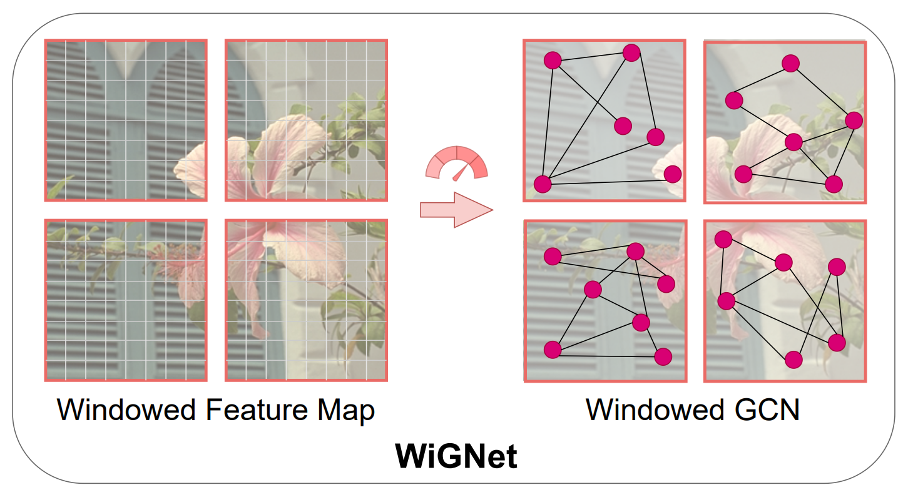
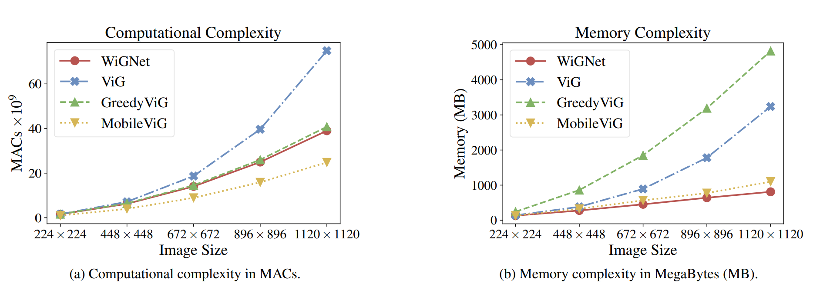
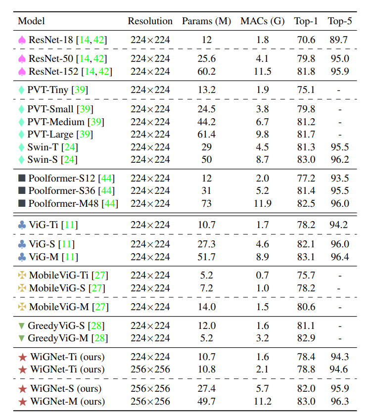
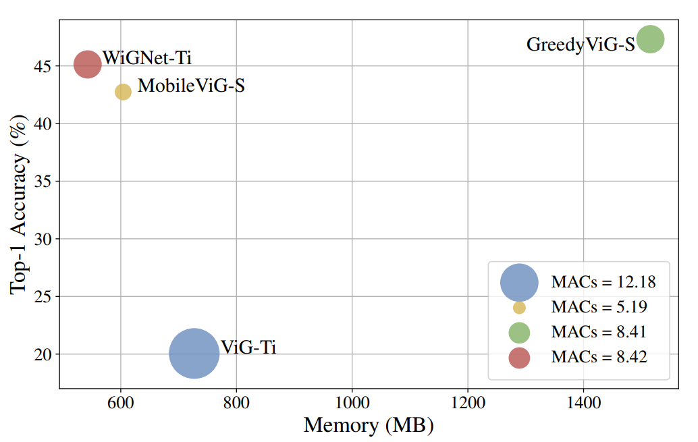

# WiGNet: Windowed Vision Graph Neural Network

Pytorch implementation of the paper "**WiGNet: Windowed Vision Graph Neural Network**", published at WACV 2025. This repository is based on [VisionGNN](https://github.com/jichengyuan/Vision_GNN).

[ArXiv](https://arxiv.org/abs/2410.00807)

<div align="center">

</div>

## Abstract
In recent years, Graph Neural Networks (GNNs) have demonstrated strong adaptability to various real-world challenges, with architectures such as Vision GNN (ViG) achieving state-of-the-art performance in several computer vision tasks. However, their practical applicability is hindered by the computational complexity of constructing the graph, which scales quadratically with the image size. In this paper, we introduce a novel Windowed vision Graph neural Network (WiGNet) model for efficient image processing. WiGNet explores a different strategy from previous works by partitioning the image into windows and constructing a graph within each window. Therefore, our model uses graph convolutions instead of the typical 2D convolution or self-attention mechanism. WiGNet effectively manages computational and memory complexity for large image sizes. We evaluate our method in the ImageNet-1k benchmark dataset and test the adaptability of WiGNet using the CelebA-HQ dataset as a downstream task with higher-resolution images. In both of these scenarios, our method achieves competitive results compared to previous vision GNNs while keeping memory and computational complexity at bay. WiGNet offers a promising solution toward the deployment of vision GNNs in real-world applications.


<div align="center">

</div>


## Usage

Download our pretrained model from [here](https://drive.google.com/file/d/11bDJaiYxCIwG2OxapIJSkQZys38wDI4S/view?usp=sharing).

### Environment
- conda env create -f env_wignet.yml
- conda activate wignet

### ImageNet Classification


- Evaluation
```
python train.py --model wignn_ti_256_gelu \
--img-size 256 \
--knn 9 \
--use-shift 1 \
--adapt-knn 1 \
--data /path/to/imagenet \
-b 128 \
--resume  /path/to/checkpoint.pth.tar \
--evaluate 
```

- Training WiGNet-Ti on 8 GPUs
```
python -m torch.distributed.launch \
--nproc_per_node=8 train.py \
--model wignn_ti_256_gelu \
--img-size 256 \
--knn 9 \
--use-shift 1 \
--adapt-knn 1 \
--use-reduce-ratios 0 \
--data /path/to/imagenet \  
--sched cosine \
--epochs 300 \
--opt adamw -j 8 \
--warmup-lr 1e-6 \
--mixup .8 \
--cutmix 1.0 \
--model-ema \
--model-ema-decay 0.99996 \
--aa rand-m9-mstd0.5-inc1 \
--color-jitter 0.4 \
--warmup-epochs 20 \
--opt-eps 1e-8 \
--remode pixel \
--reprob 0.25 \
--amp \
--lr 2e-3 \
--weight-decay .05 \
--drop 0 \
--drop-path .1 \
-b 128 \
--output /path/to/save 
```


### Complexity Evaluation

**Memory & MACs**
- WiGNet
```
python -m model.wignn
```

- ViG
```
python -m model.pyramid_vig
```

- GreedyViG
```
python -m model.greedyvig
```

- MobileViG
```
python -m model.mobilevig
```


### Transfer Learning
- WiGNet
```
python train_trasnfer_learning.py 
--model-type wignn_ti_256_gelu \
--use-shift 1 \
--adapt-knn 1 \
--batch-size 64  \
--checkpoint /path/to/checkpoint.pth.tar \
--crop-size 512 \
--dataset CelebA \
--epochs 30 \
--freeze 1 \
--loss cross_entropy \
--lr 0.001 \
--lr-scheduler constant  \
--opt adam \
--root /path/to/save/dataset \
--save-dir /path/to/save/outputs_tl_high_res/ \
--seed 1 
```

For ViG include `--num-gpu 8`

## Results

### ImageNet-1k
<div>

</div>

### CelebaHq
<div>

</div>


# Citation
If you use our code, please cite

```
    @inproceedings{spadaro2024wignet,
      title={{W}i{GN}et: {W}indowed {V}ision {G}raph {N}eural {N}etwork},
      author={Spadaro, Gabriele and Grangetto, Marco and Fiandrotti, Attilio and Tartaglione, Enzo and Giraldo, Jhony H},
      booktitle = {Proceedings of the IEEE/CVF Winter Conference on Applications of Computer Vision (WACV)},
      year={2025}
    }
```