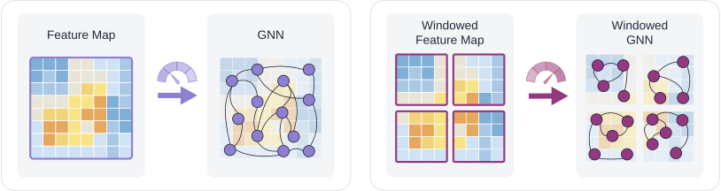
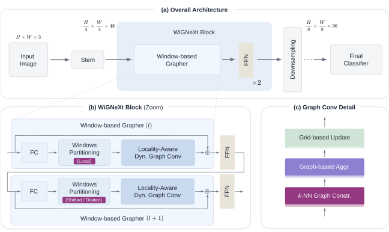

<h1 align="center">WiGNeXt: Windowed Vision Graph Neural Network with eXtended Locality</h1>
<h2 align="center">This work builds upon our previous research, presented as an <strong>Oral Presentation at WACV 2025</strong>.</h2>
<p align="center">
  
</p>
<p align="center">
<b>Authors:</b> Gabriele Spadaro<sup>1,2</sup>, Kian Bakhtari<sup>2</sup>, Aref Einizade<sup>3</sup>,
Marco Grangetto<sup>1</sup>,Attilio Fiandrotti<sup>1,2</sup>,
<br>Enzo Tartaglione<sup>2</sup>,Jhony H. Giraldo<sup>2</sup>
<br>
<sup>1</sup>Computer Science Department, University of Turin, Turin, Italy<br>
<sup>2</sup>LCTI, Télécom Paris, Institut Polytechnique de Paris, Palaiseau, France<br>
<sup>3</sup>SAMOVAR, Télécom SudParis, Institut Polytechnique de Paris, Evry, France
</p>

## 📢 Announcement 
<div style="text-align: justify;">

This work builds upon our previous research, presented as an **Oral Presentation at WACV 2025**
([WACV Paper](https://openaccess.thecvf.com/content/WACV2025/papers/Spadaro_WiGNet_Windowed_Vision_Graph_Neural_Network_WACV_2025_paper.pdf)).

Our previous window-based ViG model, **WiGNet**, was introduced in that study.
This repository extends that work introducing a unified window-based ViG models family, including **WiGNeXt** and new evaluations.


## Abstract
Graph Neural Networks (GNNs) have recently been explored as an alternative to Convolutional Neural Networks (CNNs) and Vision Transformers (ViTs) by representing images as graphs and modeling region interactions through message passing. 
However, current vision GNNs (ViGs) either rely on costly $k$-Nearest Neighbors (k-NN) graph construction or sacrifice global connectivity, making them inefficient for high-resolution tasks.
In this work, we introduce and generalize a family of windowed ViG models for efficient and scalable image processing.
Our models construct graphs within non-overlapping windows, enabling global information propagation via different cross-windows connectivity strategies. In particular, we adopt a shifted-window partitioning to enable efficient interactions between windows and a dilated-window partitioning to enhance long-range connectivity. Moreover, we propose a novel graph convolutional operator to integrate spatial information in the message-passing function.
Experiments on ImageNet-1K and COCO show that WiGNeXt matches state-of-the-art ViT and ViG backbones on classification while yielding better accuracy-efficiency trade-offs for detection and segmentation, 
achieving 45.3 APbox and 41.3 APmask on COCO while using only 3.97 GB of GPU memory.

<p align="center">
  
</p>


## Usage
Download our pretrained models from [Google Drive](https://drive.google.com/drive/folders/1BZwDBpfBKnAK7Uv_dPoaSUg4hdjBdnk1?usp=sharing)

## Train

### ImageNet classification
Training WiGNeXt-Ti on 8 GPUs
```
python -m torch.distributed.launch \
--nproc_per_node=8 src/train.py \
--wandb-project-name $WANDB_PROJ_NAME \
--num-classes 1000 \
--model wignext_ti_256_gelu \
--img-size 224 \
--window-size 8 \
--knn 9 \
--use-shift 0 \
--adapt-knn 0 \
--use-reduce-ratios 0 \
--data /path/to/imagenet/ \
--sched cosine \
--epochs 300 \
--opt adamw -j 8 \
--warmup-lr 1e-6 \
--mixup .8 \
--cutmix 1.0 \
--model-ema \
--model-ema-decay 0.99996 \
--aa rand-m9-mstd0.5-inc1 \
--color-jitter 0.4 \
--warmup-epochs 20 \
--opt-eps 1e-8 \
--remode pixel \
--reprob 0.25 \
--amp \
--lr 2e-3 \
--weight-decay .05 \
--drop 0 \
--drop-path .1 \
-b 128 \
--output /path/to/output/
```

### Detection
For training or testing detection models, use the [MMDetection](https://github.com/open-mmlab/mmdetection) framework and run the standard MMDetection training/testing workflows with the configs in `detection/configs/`.
